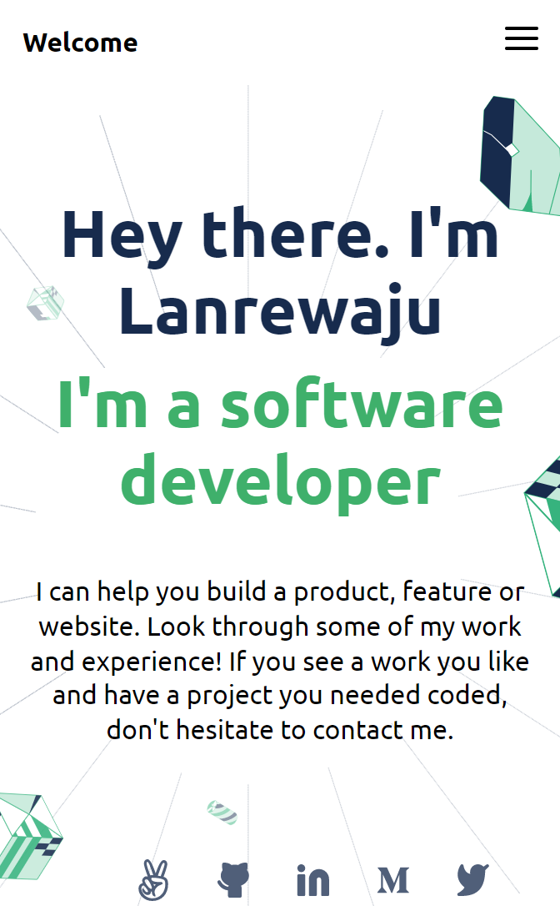

# Portfolio Project

> This is the first project i will carry out on HTML and CSS and it encompasses all of the major functions and purpose of HTML and CSS. It also creates a platform to show my works, It is based on a mobile first approach, which means the page for the mobile is designed first and it is then adapted to large screens.



This is project on building a personal portfolio from a set of figma templates.

## Built With

- HTML

  - `ul` Unordered List (To list out certain items on the page)
  - `nav` element (To create a nav-bar)
  - `a` tags (To link to other external webpages)
  - `svg` are also used in the HTML
  - HTML `form`
  - Form attributes; `action` & `method`
  - `input` attributes; `placeholder`
  - HTML5 form validation

- Java Script
- Implemented DOM manipulation in various parts of the project to make page dynamic.
- JS `Objects`, `Arrays`, & `Object Arrays` to store data of similar items.
- Implement the use of Arrow Functions `=>` and `{destructure}` methods to match the modern concentions.
- Made use of various `JS` objects and methods such as; `node.createElement()`, `node.AppendChild()`, `node.replaceChild()`, etc. to avoid the use of `innerHTML` for security considerations.
- Implemented `For---Loops`, `array.map()`, `array.forEach()`, through the course of the project to loop through `objects` in the `Objects Array`; thus making it possible to manipulate the objects and produce desired result.
- Made use of `if Statements` to match specific use cases.
- Implement the use of `Toggle classList` and `eventListeners` to make hamburger button functional.
- Implement the use of `array.find()` & `parseInt` to locate the specific objects to display when modal pops up.
- Implemented `HTML` form validity in my `JS` to enable client side validations of inputs.
- The `JSON` API `stringify` & `parse` was implemented, to enable JS Objects to be used on windows local storage.
- The `node.localStorage` `set()` & `get()` methods were used to store and retrieve user inouts, till the form is submitted.

* CSS
  - Pseudo-selectors (hover; to add hover effect to certain elements)
  - Pseudo-elements
  - CSS position property
  - `Flexbox`
  - Transition property
  - CSS background property
  - CSS `Grid`
  - `media-query` to make page responsive

## Live Demo

[Live Demo Link](https://abass-portfolio-project.netlify.app/)

### Development (Running locally)

- Clone the project

```bash
git clone https://github.com/Lanr3waju/portfolio-project.git
```

- Install Dependencies

```bash
npm install
```

To run StyleLint by itself, you may run the lint task:

```bash
npm run lint:check
```

Or to automatically fix issues found (where possible):

```bash
npm run lint
```

You can also check against Prettier:

```bash
npm run format:check
```

and to have it actually fix (to the best of its ability) any format issues, run:

```bash
npm run format
```

You can also check against HTML Validator:

```bash
npm run html-validator
```

## Style Guides

- [CSS Style Guide](http://udacity.github.io/frontend-nanodegree-styleguide/css.html)
- [HTML Style Guide](http://udacity.github.io/frontend-nanodegree-styleguide/index.html)
- [JavaScript Style Guide](http://udacity.github.io/frontend-nanodegree-styleguide/javascript.html)
- [Git Style Guide](https://udacity.github.io/git-styleguide/)

## 👤 Author

- Github: [@Lanr3waju]https://github.com/Lanr3waju)
- Instagram: [@Abass Olanrewaju](https://www.instagram.com/abass.abdul.wasii)

## 🤝 Contributing

Contributions, issues and feature requests are welcome!

Feel free to check the [issues page](../../issues).

## Show your support

Give a ⭐️ if you like this project!

## Acknowledgments

- I appreciate the efforts of my mentors in the web development for their guidance and contribtution

## 📝 License

[MIT licensed](./LICENSE).
